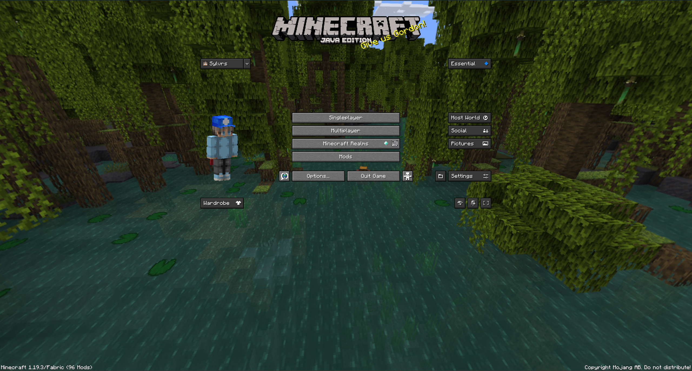

# Installation - PolyMC

Installing the modpack through PolyMC is *extremely* simple. All one has to do is follow the simple steps below and you'll be off to the races!

NOTE: This installation assumes that you are using Windows to install. Installation on Mac is just as easy and should be extremely similar

## Step 1 - Download
First, download the PolyMC launcher for your respective operating system from [here](https://polymc.org/download/).

After the file is done downloading, install as you would any other program and configure how you'd like. Open after the installation is complete.

## Step 2 - Signing In
Once you have the launcher installed and opened, you will be greeted by the opening screen, which itself contains an element named "Profiles" next to a Steve head. Click the icon.

From there, click the "Manage Accounts" option.

Then, add your account through whatever means you usually use to sign in with.

If all is done correctly, an account will be added to your launcher.

## Step 3 - Adding Modpack

Now that you are signed in, navigate to the [Releases page](https://github.com/sylvrs/electric-cowboy/releases) and look for the first file link named something like `electric-cowboy-v[VERSION].zip`. From there, save the file and navigate back to PolyMC.

Once back on the main screen of PolyMC, click the "Add Instance" button followed by the "Import from zip" option on the "New Instance" menu.

From there, click browse, change the file input type from `.zip` to `.mrpack` in the bottom right of the file explorer, locate your file, and click "Open".

## Step 4 - Opening Instance
Now that your instance is installed, open the modpack by double clicking its name.

Congratulations! You have now successfully installed the modpack and are ready to play! Make sure to configure your game however you need to! This may include adding resource packs, tuning graphic options, and updating keybinds!
